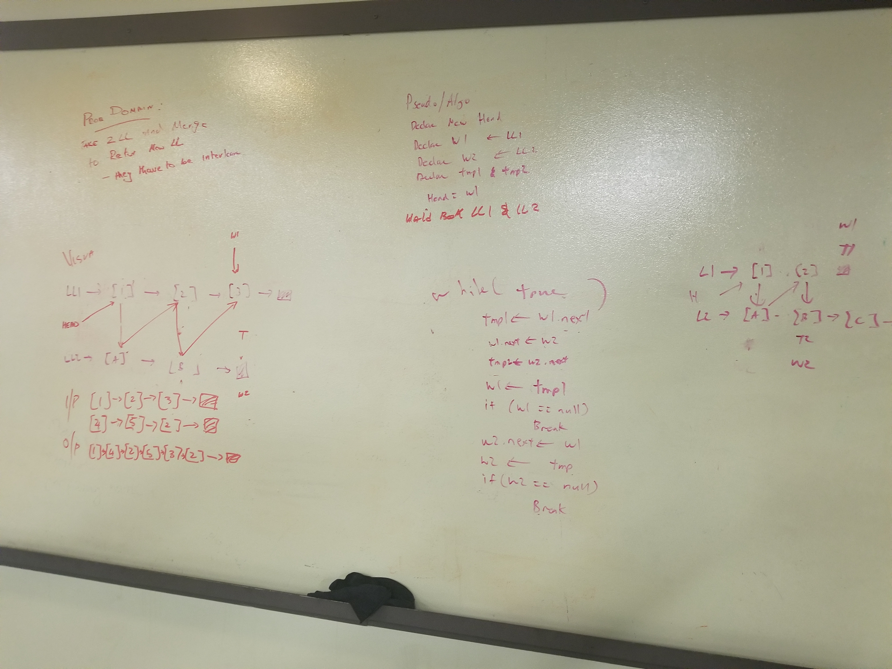

## LinkedList
  ###LinkedList.class
  <!-- Description of the challenge -->
  Create a Node class that has properties for the value stored in the Node, and a pointer to the next Node.
  Within your LinkedList class, include a head property. Upon instantiation, an empty Linked List should be created.
  ### Approach & Efficiency
  <!-- What approach did you take? Why? What is the Big O space/time for this approach? -->
  
 
  A linear algorithm – O(n) Runtime grows directly in proportion to n
  
  ### Solution 
  - [LinkedList Code](../../src/main/java/linkedList/LinkedList.java)
  
  #### White board Solution  for LinkedList append, insertBefore and insertAfter
   
   
  #### White board Solution for ll_kth_from_end
  
  
  #### White board Solution for mergeLists
   
  
  #### Shout out to Luke chandler fro helping me  writing test for  ll_kth_from_end . 
  
  
  ##API
  ```
  LinkedList.insert 
  ```
  ```
  LinkedList.Includes
   ```
  ```
  LinkedList.prints
  ```
  ```
  LinkedList.insertBefore
```
```
LinkedList.append
```
```
LinkedList.insertAfter
```
```
LinkedList.ll_kth_from_end
```
```
LinkedList.mergeLists
```
  - [LinkedList Test ](../../src/main/java/linkedList/LinkedListTest.java)