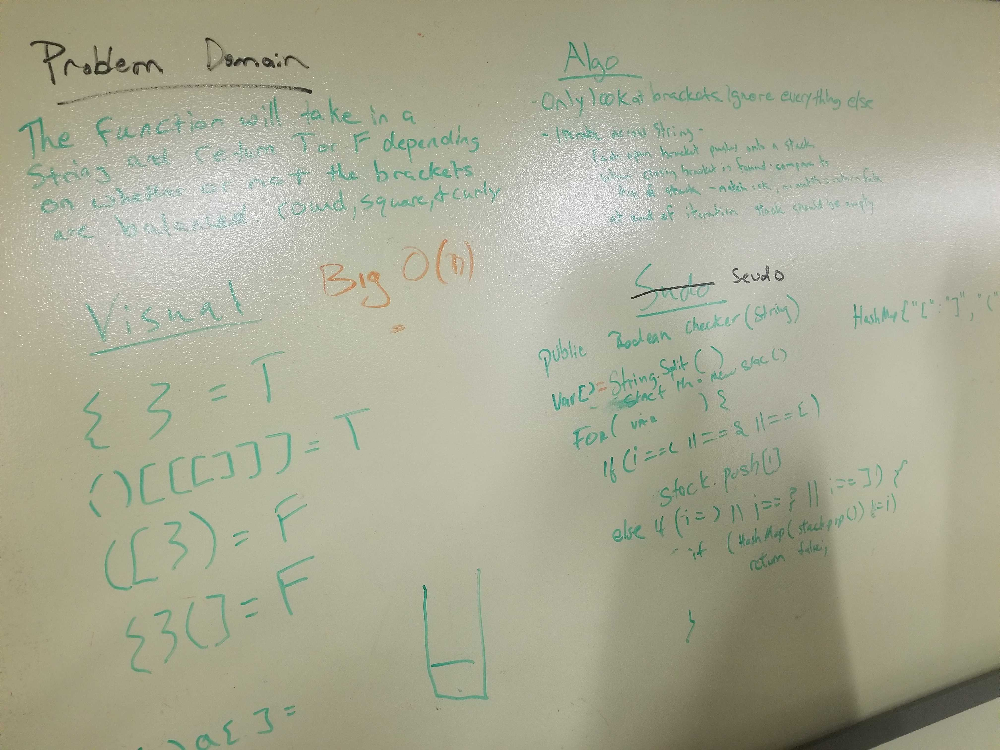

## MultiBracketValidation

### multiBracketValidation.class
  <!-- Description of the challenge -->
Function Will take a string as its only argument, and will return a boolean representing whether or not the brackets in the string are balanced and mached

## Approach and Efficiency
I Used Stack to store my brackets from String  and I loop through it to first check for open brackets if they are open i push them into stack if they are closing brackets then i peek at stack to see if brackets match then i pop from stack if they dont match i return false 
 
 Time space complexity is Big O(1).
 
 
  
  ### Solution   
   