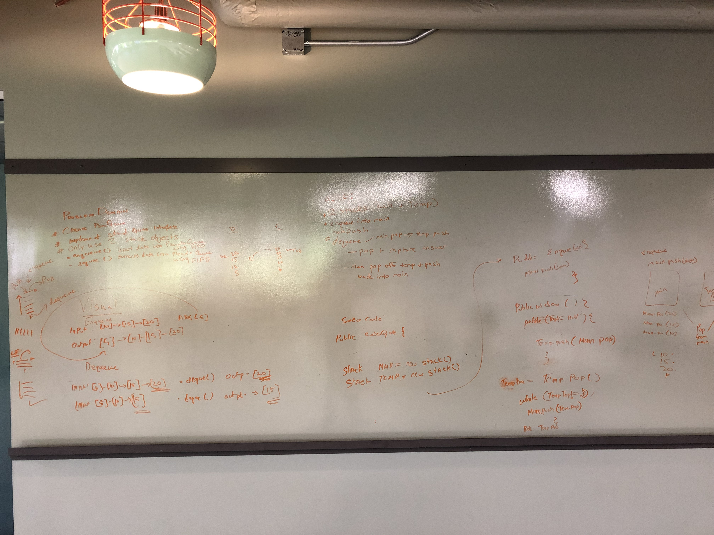

## fifo_Animal_Shelter

### AnimalShelter.class
  <!-- Description of the challenge -->
Create a class called AnimalShelter which holds only dogs and cats. The shelter operates using a first-in, first-out approach.
Implement the following methods:
enqueue(animal): adds animal to the shelter. animal can be either a dog or a cat object.
dequeue(pref): returns either a dog or a cat. If pref is not "dog" or "cat" then return null.


## Approach and Efficiency
- create a new node class
- create a basic animal class
- create an ```enqueue()```
- create a ```dequeue()```
 
 Time space complexity is Big O(1).
 
 
  
  ### Solution   
   